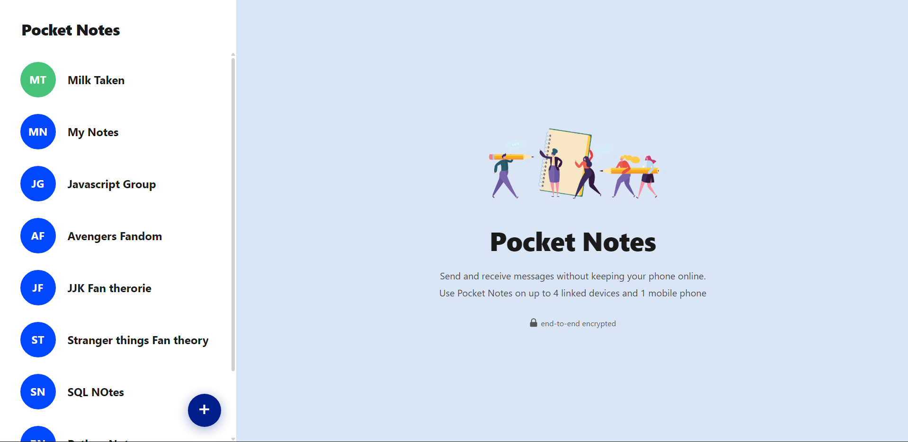
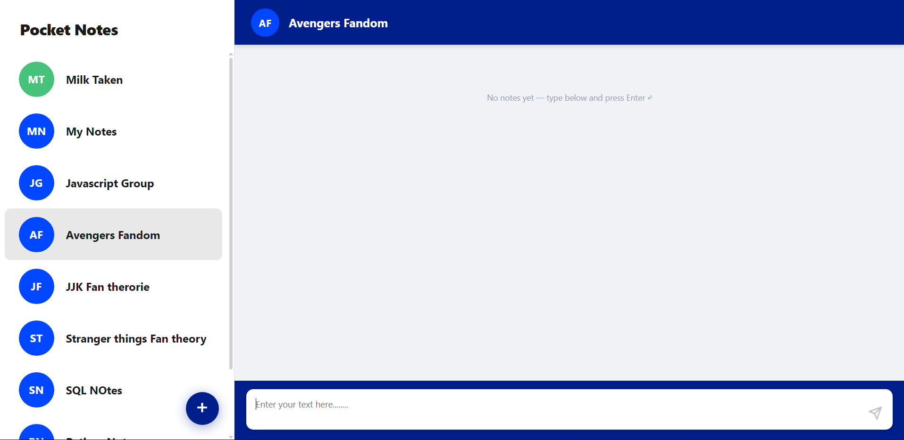
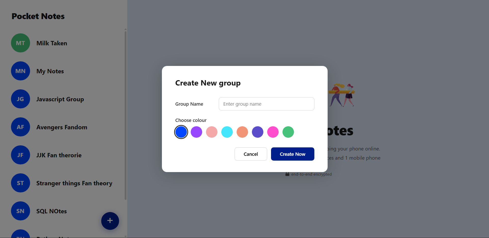

# 📒 Pocket Notes

A clean, group-based note-taking web app built with React. Organize your notes into groups, save them instantly, and access them anytime — all without a backend or login.


---

## ✨ Features

- **Create note groups** — organize notes by topic, project, or anything you like
- **Color-coded avatars** — each group gets a unique color and 2-letter initial badge
- **Instant saving** — press `Enter` or click the send button to save a note
- **Timestamps** — every note shows the date and time it was created
- **Persistent storage** — notes survive page refreshes via `localStorage`
- **No duplicates** — group names are validated to prevent conflicts
- **Mobile responsive** — sidebar and notes panel toggle cleanly on small screens
- **Zero dependencies** — no external UI libraries, just React

---

## 📸 Screenshots

| Welcome Screen | Notes View |
|---|---|
|  |  |

| Create Group Modal | Mobile View |
|---|---|
|  |  |

> 💡 Replace the placeholder images above with real screenshots of your app.
> In your repo, add screenshots to a `docs/` folder and update the paths above.

---

## 🚀 Getting Started

### Prerequisites

- [Node.js](https://nodejs.org/) v16 or higher
- npm (comes with Node)

### Installation

```bash
# 1. Clone the repository
git clone https://github.com/YOUR_USERNAME/pocket-notes.git

# 2. Navigate into the project
cd pocket-notes

# 3. Install dependencies
npm install

# 4. Start the development server
npm start
```

The app will open at **http://localhost:3000**

---

## 🏗️ Project Structure

```
src/
├── App.jsx                        ← Root component — layout & wiring only
├── index.js                       ← React entry point
│
├── assets/
│   └── welcome-illustration.svg   ← Hero illustration on the welcome screen
│
├── components/                    ← UI components, each owns its styles
│   ├── Avatar.jsx                 ← Colored circle with 2-letter initials
│   ├── CreateGroupModal.jsx       ← Popup: group name + color picker
│   ├── NoteCard.jsx               ← Single note with text + timestamp
│   ├── NoteInput.jsx              ← Textarea + send button bar
│   ├── NotesPanel.jsx             ← Header + note list + input (right panel)
│   ├── Sidebar.jsx                ← Group list + FAB button (left panel)
│   └── WelcomeScreen.jsx          ← Shown when no group is selected
│
├── hooks/
│   ├── useNotes.js                ← All state + localStorage persistence
│   └── useWindowSize.js           ← Window width → mobile layout toggle
│
├── styles/
│   └── globalStyles.js            ← CSS reset, scrollbars, media queries
│
└── utils/
    ├── constants.js               ← Storage keys + group color palette
    └── helpers.js                 ← getInitials, formatDate, formatTime, storage
```

---

## 🧠 Architecture

This project follows a **layered architecture** — each layer has a single responsibility:

```
┌─────────────────────────────────────────┐
│  App.jsx        — wires everything      │
├─────────────────────────────────────────┤
│  components/    — UI, owns its styles   │
├─────────────────────────────────────────┤
│  hooks/         — state & persistence   │
├─────────────────────────────────────────┤
│  utils/         — pure JS functions     │
└─────────────────────────────────────────┘
```

**Key principles:**

- **Each component owns its styles** — `const styles = {}` lives right in the component file. No hunting across files.
- **All state lives in one hook** — `useNotes.js` manages groups, notes, and the active selection. Components just call `addNote()` and `createGroup()`.
- **Utils are pure JS** — `helpers.js` has zero React imports. Easy to read, easy to test.
- **`App.jsx` is just wiring** — reads hooks, decides what to render, passes props down. No business logic inline.

---

## 🔄 Data Flow

```
localStorage
    ↕  read on mount · write on every change
useNotes.js
    ↓  groups · activeGroup · activeNotes · existingNames
App.jsx
    ├── Sidebar            groups, activeGroup, onSelect, onNewGroup
    ├── NotesPanel         group, notes, onAdd, onBack
    │     ├── Avatar
    │     ├── NoteCard × N
    │     └── NoteInput
    ├── WelcomeScreen
    └── CreateGroupModal   onClose, onCreate, existingNames
```

---

## 🛠️ Available Scripts

| Script | Description |
|---|---|
| `npm start` | Run development server at localhost:3000 |
| `npm run build` | Build optimized production bundle into `build/` |
| `npm test` | Run tests in interactive watch mode |

---

## 💾 How Data is Stored

No backend, no database. Everything lives in the browser's `localStorage`:

```
localStorage
├── "pocket_notes_groups"  →  [{ id, name, color, createdAt }, ...]
└── "pocket_notes_notes"   →  { groupId: [{ id, text, createdAt, updatedAt }] }
```

Data persists across page reloads but is **browser-local** — it won't sync between devices.

---

## 📱 Responsive Behaviour

| Screen Width | Layout |
|---|---|
| > 680px (desktop) | Sidebar + Notes panel side by side |
| ≤ 680px (mobile) | Sidebar only → tap a group → Notes panel with back button |

---

## 🤝 Contributing

Contributions, issues and feature requests are welcome!

```bash
# 1. Fork the repo on GitHub
# 2. Create a feature branch
git checkout -b feat/your-feature-name

# 3. Make your changes and commit
git commit -m "feat: describe your change"

# 4. Push to your fork
git push origin feat/your-feature-name

# 5. Open a Pull Request on GitHub
```

---

## 📄 License

This project is open source and available under the [MIT License](LICENSE).

---

## 👤 Author

**Your Name**
- GitHub: [DanteKruz](https://github.com/DanteKruz)

---

<p align="center">Made with ❤️ and React</p>